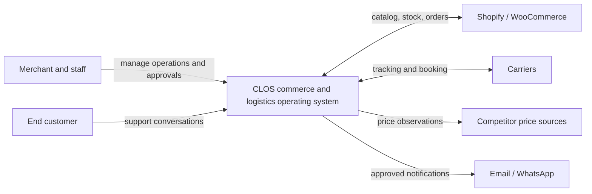

# C4 context

```mermaid
flowchart LR
  Merchant[Merchant and staff]
  Customer[End customer]
  CLOS[CLOS commerce and logistics operating system]
  Store[Shopify / WooCommerce]
  Carrier[Carriers]
  Competitor[Competitor price sources]
  Notify[Email / WhatsApp]
  Merchant -->|manage operations and approvals| CLOS
  Customer -->|support conversations| CLOS
  CLOS <-->|catalog, stock, orders| Store
  CLOS <-->|tracking and booking| Carrier
  CLOS -->|price observations| Competitor
  CLOS -->|approved notifications| Notify
```

