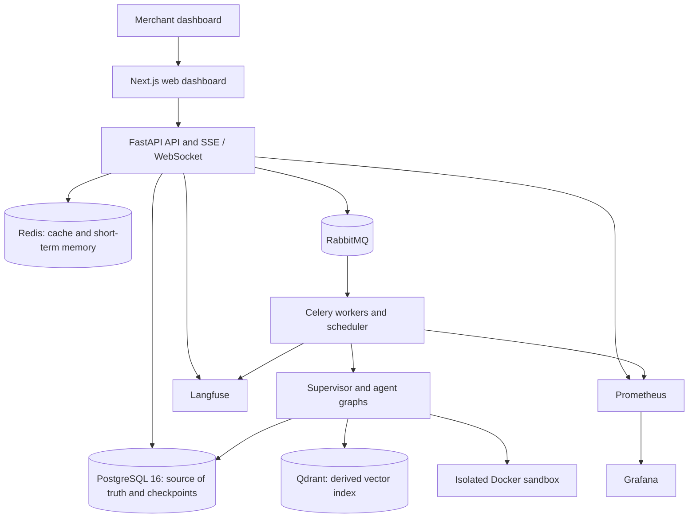

# C4 container diagram

```mermaid
flowchart TB
  Merchant[Merchant dashboard]
  Web[Next.js web dashboard]
  API[FastAPI API and SSE / WebSocket]
  Worker[Celery workers and scheduler]
  Graph[Supervisor and agent graphs]
  PG[(PostgreSQL 16: source of truth and checkpoints)]
  Q[(Qdrant: derived vector index)]
  R[(Redis: cache and short-term memory)]
  MQ[(RabbitMQ)]
  LF[Langfuse]
  P[Prometheus]
  G[Grafana]
  Sand[Isolated Docker sandbox]
  Merchant --> Web --> API
  API --> PG
  API --> R
  API --> MQ
  MQ --> Worker --> Graph
  Graph --> PG
  Graph --> Q
  Graph --> Sand
  API --> LF
  Worker --> LF
  API --> P
  Worker --> P
  P --> G
```

