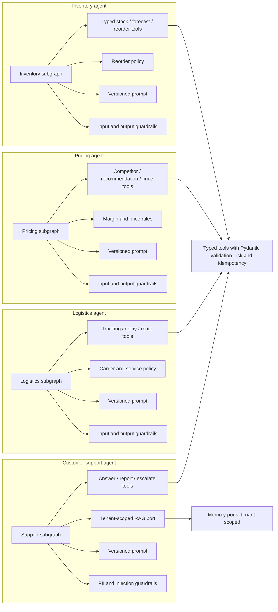

# Agent component diagrams

```mermaid
flowchart LR
  subgraph Inventory[Inventory agent]
    IGraph[Inventory subgraph] --> ITools[Typed stock / forecast / reorder tools]
    IGraph --> IPolicy[Reorder policy]
    IGraph --> IPrompt[Versioned prompt]
    IGraph --> IGuard[Input and output guardrails]
  end
  subgraph Pricing[Pricing agent]
    PGraph[Pricing subgraph] --> PTools[Competitor / recommendation / price tools]
    PGraph --> PPolicy[Margin and price rules]
    PGraph --> PPrompt[Versioned prompt]
    PGraph --> PGuard[Input and output guardrails]
  end
  subgraph Logistics[Logistics agent]
    LGraph[Logistics subgraph] --> LTools[Tracking / delay / route tools]
    LGraph --> LPolicy[Carrier and service policy]
    LGraph --> LPrompt[Versioned prompt]
    LGraph --> LGuard[Input and output guardrails]
  end
  subgraph Support[Customer support agent]
    SGraph[Support subgraph] --> STools[Answer / report / escalate tools]
    SGraph --> SRAG[Tenant-scoped RAG port]
    SGraph --> SPrompt[Versioned prompt]
    SGraph --> SGuard[PII and injection guardrails]
  end
  Tools[Typed tools with Pydantic validation, risk and idempotency]
  Memory[Memory ports: tenant-scoped]
  ITools --> Tools
  PTools --> Tools
  LTools --> Tools
  STools --> Tools
  SRAG --> Memory
```

