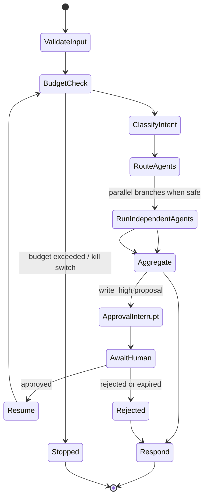

# Supervisor LangGraph state diagram

```mermaid
stateDiagram-v2
  [*] --> ValidateInput
  ValidateInput --> BudgetCheck
  BudgetCheck --> ClassifyIntent
  BudgetCheck --> Stopped: budget exceeded / kill switch
  ClassifyIntent --> RouteAgents
  RouteAgents --> RunIndependentAgents: parallel branches when safe
  RunIndependentAgents --> Aggregate
  Aggregate --> ApprovalInterrupt: write_high proposal
  ApprovalInterrupt --> AwaitHuman
  AwaitHuman --> Resume: approved
  AwaitHuman --> Rejected: rejected or expired
  Resume --> BudgetCheck
  RunIndependentAgents --> Aggregate
  Aggregate --> Respond
  Rejected --> Respond
  Respond --> [*]
  Stopped --> [*]
```

