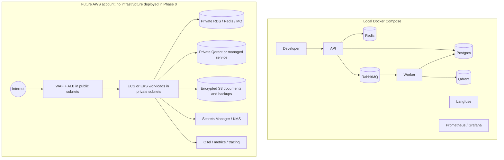

# Deployment topology

```mermaid
flowchart TB
  subgraph Local[Local Docker Compose]
    Dev[Developer]
    API[API]
    Worker[Worker]
    PG[(Postgres)]
    Q[(Qdrant)]
    R[(Redis)]
    MQ[(RabbitMQ)]
    LF[Langfuse]
    Prom[Prometheus / Grafana]
    Dev --> API
    API --> PG
    API --> R
    API --> MQ
    MQ --> Worker
    Worker --> PG
    Worker --> Q
  end
  subgraph AWS[Future AWS account; no infrastructure deployed in Phase 0]
    Internet((Internet)) --> WAF[WAF + ALB in public subnets]
    WAF --> App[ECS or EKS workloads in private subnets]
    App --> Data[(Private RDS / Redis / MQ)]
    App --> Vector[(Private Qdrant or managed service)]
    App --> S3[(Encrypted S3 documents and backups)]
    App --> Secrets[Secrets Manager / KMS]
    App --> Obs[OTel / metrics / tracing]
  end
```

AWS region, compute, and managed-service choices remain unresolved and require ADRs based on residency and operational evidence.

